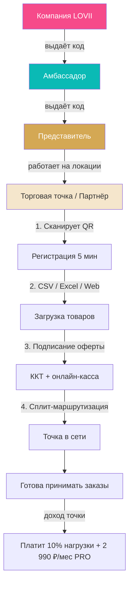
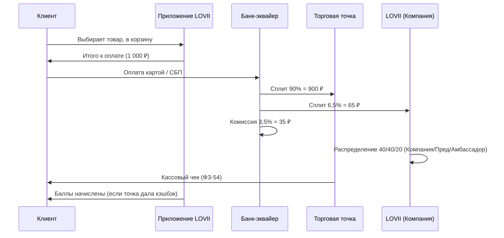
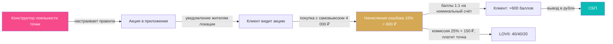
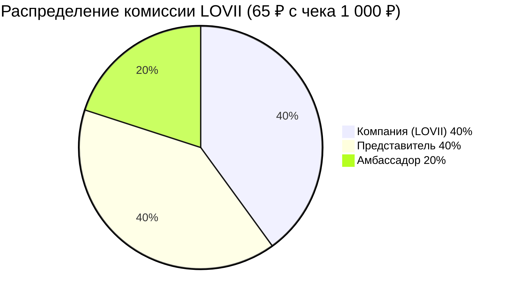
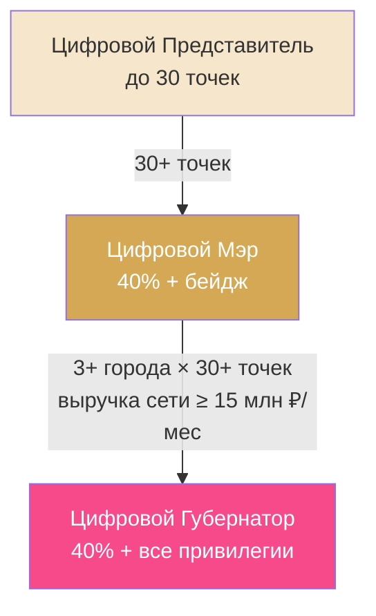
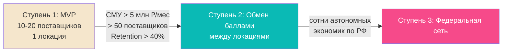

# LOVII — Бизнес-процессы

> **Назначение:** описание ключевых бизнес-процессов платформы LOVII с визуализацией.
> Все процессы опираются на `PARAMS.md` (параметры) и `FINANCIAL_MODEL.md` (финконтур).
>
> Версия: 1.0 · Дата: 2026-07-17 · Формат: Mermaid (нативный рендеринг GitHub)

---

## Оглавление

1. [Подключение торговой точки](#1-подключение-торговой-точки)
2. [Покупка клиента](#2-покупка-клиента)
3. [Кэшбэк и лояльность](#3-кэшбэк-и-лояльность)
4. [Доходы и рост сети](#4-доходы-и-рост-сети)

---

## 1. Подключение торговой точки

Цепочка распространения: **Компания → Амбассадор → Представитель → Точка**.
Точка подключается за ~5 минут через QR-код, без сложных договоров.

**Ключевые факты:**
- Онбординг: **5 минут** (QR для самозанятых, Excel/Web для ИП/ООО)
- Регистрация по публичной оферте (ФЗ-437 ГК РФ)
- Порог 0% комиссии: оборот до **30 000 ₽/мес**

---

## 2. Покупка клиента

Клиент выбирает товар, оплачивает — банк сплитует платёж: точка получает 90%,
LOVII 6,5%, банк 3,5%.

**Распределение комиссии LOVII (65 ₽):**

| Получатель | Доля | Сумма |
|---|---|---|
| Компания (LOVII) | 40% | 26 ₽ |
| Представитель | 40% | 26 ₽ |
| Амбассадор | 20% | 13 ₽ |

---

## 3. Кэшбэк и лояльность

Баллы начисляются **только если точка дала кэшбэк** через конструктор лояльности.
Комиссия платформы **25%** от суммы кэшбэка — платит точка сверху.

**Пример (пиццерия, пятница):**
- Базовый кэшбэк 5% = 200 ₽ (популярные пиццы)
- +10% за самовывоз (чек > 3 500 ₽) = 400 ₽
- Итого 15% = **600 ₽** → баллы клиенту
- Комиссия LOVII 25% от 600 = **150 ₽** (платит точка): Компания 60 / Представитель 60 / Амбассадор 30
- Подарок (пицца за 3 500 ₽) — расход точки, комиссии нет

> **Важно:** баллы НЕ копятся с каждой покупки автоматически. Только по инициативе
> точки через конструктор. 1 балл = 1 ₽, не сгорают, вывод через СБП.

---

## 4. Доходы и рост сети

### 4.1. Распределение дохода (базовая схема 40/40/20)

### 4.2. Рост статуса представителя

> Цифровые роли — только внутри Лови, без привилегий в реальном мире. Значимы и
> поощряются компанией (заслуги, бейджи, выплаты).

### 4.3. Масштабирование (MVP → Федерация)

**Целевые показатели:**

| Этап | Метрика | Значение |
|---|---|---|
| MVP (6 мес) | GMV | > 25 млн ₽ |
| MVP (6 мес) | Точки | > 30 |
| Порог масштабирования | GMV / поставщики / Retention | > 5 млн ₽/мес / > 50 / > 40% |
| Зрелая локация (18 мес) | Точки | > 200 |
| Целевая капитализация | — | 3 млрд ₽ |

---

## Связанные документы

- [`PARAMS.md`](PARAMS.md) — все параметры (комиссии, тарифы, роли, палитра)
- [`FINANCIAL_MODEL.md`](FINANCIAL_MODEL.md) — финансовый контур (3 слоя + кэшбэк)
- [`FACT_MAP.md`](FACT_MAP.md) — карта фактов и решения владельца
